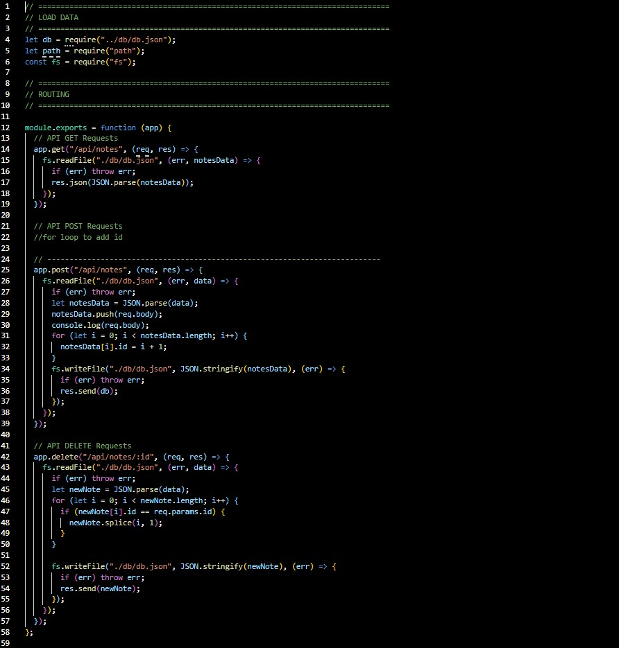

# Note Taker Using Express

## Overview

As a user, I want to be able to write and save notes. I also want to be able to delete notes I've written before, so
that I can organize my thoughts and keep track of tasks I need to complete.

## Table of Contents

- [Description](#description)
- [Installation](#installation)
- [Usage](#usage)
- [Test](#test)
- [Deployed](#deployed)
- [Tools](#tools)
- [Research](#research)
- [Questions](#questions)
- [License](#license)

## Description

To dynamically and quickly create notes data, Express and Heroku were utilized to:

- Serve and display a working data base.
- The user's input was gathered and added as notes which can be deleted.

## Installation

1. Create a .gitignore file and include node_modules and .DS store. This ensures that the node_modules directory isn't
   tracked or uploaded to GitHub.
2. Use the command-line, npm install, to install Express.
3. To start saving notes with Express, use the command, node server.js.

## Usage

- Express and Heroku and used to serve and display to the the user web pages to create their HTML ntoes..
- fs.writeFile is used to render the HTML.
- Once the user's information regarding:
  - notes are served:
- An HTML file with the user's saved notes and unique id is created.
- User's saved notes can be deleted based on the id in the db.json.

## Test

Test the different HTML pages/positions on the local host using Express, to ensure that the data is saving and the HTML
page are rendering.

## Deployed

- \*[Deployed website](https://blooming-inlet-06982.herokuapp.com/)
- \*[GitHub Repository](https://github.com/Kay0s/ExpressNoteTaker)

### Screenshot of API.Routes Code

## Tools

- HTML
- CSS
- JavaScript
- .gitignore
- Git Bash
- Heroku
- Express

## Research

- [Serving static files in Express - Express](https://expressjs.com/en/starter/static-files.html)
- [Deploying with Git- Heroku](https://devcenter.heroku.com/articles/git)
- [Use ExpressJS to Get URL and Post Parameters - DigitalOcean](https://www.digitalocean.com/community/tutorials/use-expressjs-to-get-url-and-post-parameters)

## Questions

- [Email](hamilton.kristina@gmail.com)
- [GitHub Profile](https://github.com/Kay0s)
- [GitHub Repository](https://github.com/Kay0s/https://github.com/Kay0s/TeamGenerator)

## License

© 2020 Kristina Hamilton and Trilogy Education Services, a 2U, Inc. brand. All Rights Reserved. Permission is hereby
granted, free of charge, to any person obtaining a copy of this software and associated documentation files (the
"Software"), to deal in the Software without restriction, including without limitation the rights to use, copy, modify,
merge, publish, distribute, sublicense, and/or sell copies of the Software, and to permit persons to whom the Software
is furnished to do so, subject to the following conditions:

The above copyright notice and this permission notice shall be included in all copies or substantial portions of the
Software.

THE SOFTWARE IS PROVIDED "AS IS", WITHOUT WARRANTY OF ANY KIND, EXPRESS OR IMPLIED, INCLUDING BUT NOT LIMITED TO THE
WARRANTIES OF MERCHANTABILITY, FITNESS FOR A PARTICULAR PURPOSE AND NONINFRINGEMENT. IN NO EVENT SHALL THE AUTHORS OR
COPYRIGHT HOLDERS BE LIABLE FOR ANY CLAIM, DAMAGES OR OTHER LIABILITY, WHETHER IN AN ACTION OF CONTRACT, TORT OR
OTHERWISE, ARISING FROM, OUT OF OR IN CONNECTION WITH THE SOFTWARE OR THE USE OR OTHER DEALINGS IN THE SOFTWARE.
